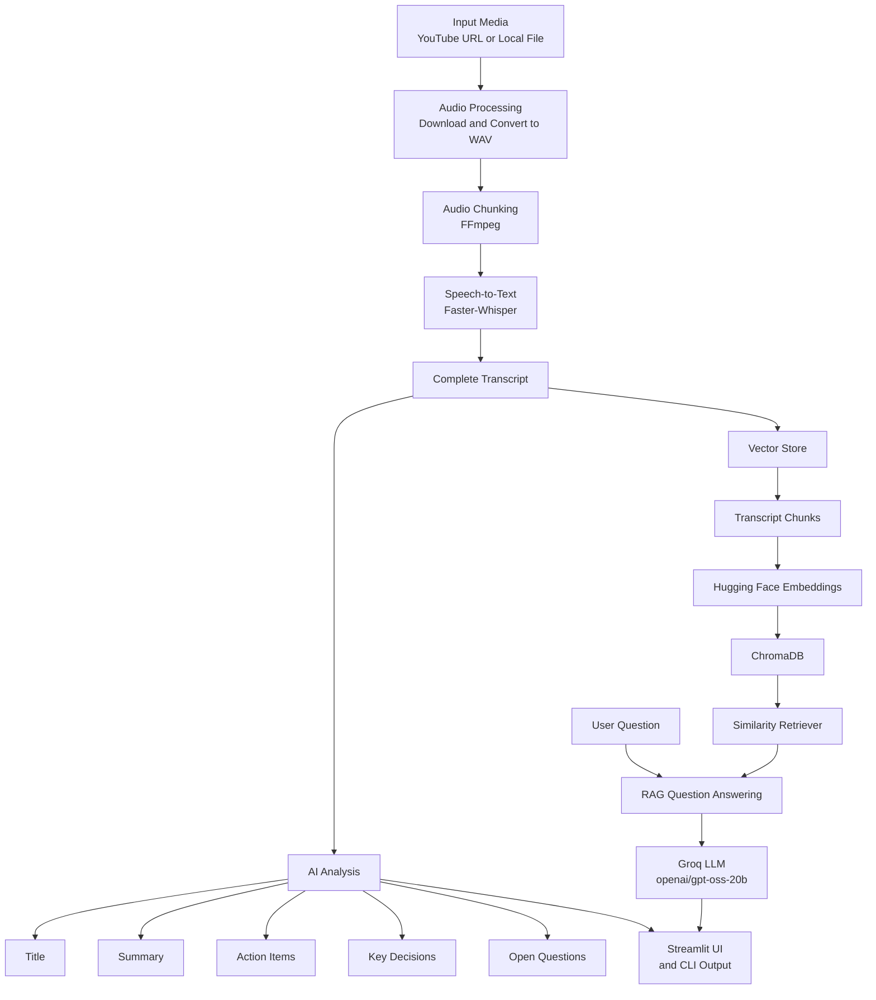
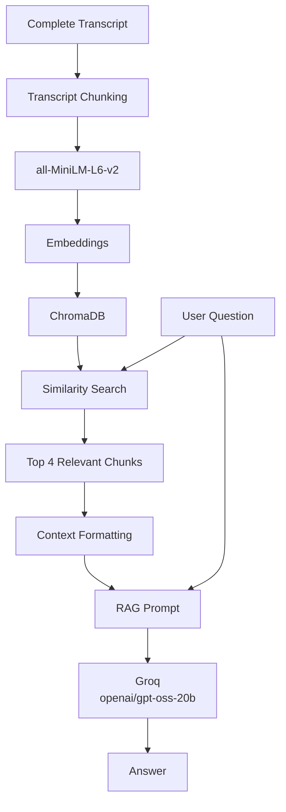

# 🎥 AI Video Assistant

An AI-powered video analysis application that transforms YouTube videos and local audio/video files into structured, searchable insights.

AI Video Assistant combines speech-to-text, Large Language Models (LLMs), semantic search, and Retrieval-Augmented Generation (RAG) to help users understand long-form video content without manually going through the entire recording.

The application processes the audio, generates a complete transcript, and uses the transcript to produce a professional summary, action items, key decisions, and open questions. The transcript is also indexed into a vector database, allowing users to ask questions about the video through a conversational RAG interface.


## 🏗️ System Architecture

The application follows a modular pipeline that combines media processing, speech-to-text, LLM-based analysis, vector storage, semantic retrieval, and Retrieval-Augmented Generation (RAG).
.png)

## ✨ Key Features

### 🎬 YouTube & Local Media Input

- Accepts YouTube video URLs as input.
- Supports local audio and video files.
- Automatically processes the provided media before transcription.

### 🔊 Audio Processing & Chunking

- Downloads YouTube audio using `yt-dlp`.
- Converts audio into WAV format using Pydub.
- Standardizes audio to 16 kHz mono.
- Splits long recordings into smaller audio chunks using FFmpeg for efficient processing.

### 🎙️ Multilingual Speech-to-Text

- Supports English and Hinglish transcription.
- Uses Faster-Whisper for English speech recognition.
- Uses Sarvam Speech-to-Text for Hinglish.
- Processes audio chunks and combines the resulting text into a complete transcript.

### 🧠 AI-Powered Video Analysis

Generates structured insights from the transcript using an LLM:

- Professional video/meeting title
- Concise summary
- Action items
- Key decisions
- Open questions

### 🔎 Semantic Search with Vector Database

- Splits the transcript into smaller chunks.
- Generates embeddings using `all-MiniLM-L6-v2`.
- Stores transcript embeddings in ChromaDB.
- Uses similarity search to retrieve relevant transcript content.

### 🧩 Retrieval-Augmented Generation (RAG)

- Retrieves the most relevant transcript chunks for a user's question.
- Uses top-4 similarity retrieval.
- Passes retrieved transcript context to the LLM.
- Grounds answers in the processed video's content.

### 💬 Conversational Video Q&A

- Allows users to ask questions about the processed video.
- Generates answers using retrieved transcript context.
- Provides a fallback response when the requested information cannot be found in the transcript.

### 🖥️ Interactive Streamlit Interface

- Provides a single interface for the complete workflow.
- Allows users to select the input source and language.
- Displays analysis results and the complete transcript.
- Provides an interactive RAG-based question-answering interface.

## 🔄 How the Application Works

The application follows a sequential processing pipeline that converts raw video or audio into structured insights and a searchable knowledge base.





### Main Modules

| Stage | Project Modules |
|---|---|
| Audio processing | `utils/audio_processor.py` |
| Transcription | `core/transcriber.py` |
| AI analysis | `core/summarizer.py`, `core/extractor.py` |
| Vector storage | `core/vector_store.py` |
| RAG question answering | `core/rag_engine.py` |
| Application entry points | `main.py`, `app.py` |

## 🧩 Retrieval-Augmented Generation (RAG) Pipeline

The RAG pipeline allows users to ask questions about the processed video and receive answers grounded in the video transcript.

Instead of sending the complete transcript to the language model for every question, the application divides the transcript into smaller chunks, converts them into embeddings, stores them in ChromaDB, and retrieves only the most relevant sections for each query.



### RAG Process

1. **Transcript chunking**  
   The complete transcript is divided into smaller sections.

2. **Embedding generation**  
   The `all-MiniLM-L6-v2` model converts each transcript chunk into a numerical vector representation.

3. **Vector storage**  
   The embeddings and their corresponding transcript text are stored in ChromaDB.

4. **Similarity search**  
   When the user asks a question, the system searches ChromaDB for the most relevant transcript chunks.

5. **Top-k retrieval**  
   The four most relevant chunks are selected as context.

6. **Context formatting**  
   The retrieved chunks are combined into a structured context for the language model.

7. **Answer generation**  
   The formatted context and user question are passed to Groq’s `openai/gpt-oss-20b` model.

8. **Grounded response**  
   The assistant generates an answer based only on the retrieved transcript context.

## 🧰 Tech Stack

### 💻 Programming & Application

| Technology | Purpose |
|---|---|
| **Python** | Core programming language used to build the application and processing pipeline |
| **Streamlit** | Interactive web interface for video analysis and RAG-based question answering |
| **python-dotenv** | Loads API keys and configuration from environment variables |

---

### 🎙️ Speech-to-Text & Audio Processing

| Technology | Purpose |
|---|---|
| **Faster-Whisper** | Local English speech-to-text transcription |
| **Sarvam Speech-to-Text** | Hinglish speech-to-text transcription |
| **yt-dlp** | Downloads audio from YouTube videos |
| **Pydub** | Audio conversion and manipulation |
| **FFmpeg** | Audio conversion, standardization, and chunking |

---

### 🧠 Generative AI & LLM

| Technology | Purpose |
|---|---|
| **Groq API** | Provides the LLM inference layer |
| **GPT-OSS-20B** | Generates titles, summaries, extracted insights, and RAG responses |
| **LangChain** | Provides LLM orchestration, prompts, chains, document handling, and RAG components |

---

### 🔎 Embeddings & Vector Search

| Technology | Purpose |
|---|---|
| **all-MiniLM-L6-v2** | Generates semantic embeddings for transcript chunks |
| **ChromaDB** | Stores transcript embeddings and enables similarity-based retrieval |
| **LangChain Chroma Integration** | Connects the application to the ChromaDB vector store |

---

### 🧩 RAG Components

| Component | Role |
|---|---|
| **Document Chunking** | Divides the transcript into smaller searchable sections |
| **Embeddings** | Converts transcript chunks into semantic vector representations |
| **ChromaDB** | Stores and searches the vector representations |
| **Similarity Retriever** | Retrieves the top 4 relevant transcript chunks |
| **Prompt Templates** | Combines retrieved context with the user's question |
| **Groq LLM** | Generates the final transcript-grounded response |

## 📁 Project Structure

The repository is organized into separate modules for audio processing, transcription, AI analysis, vector storage, RAG-based question answering, and the Streamlit interface.

```text
AI-Video-Assistant/
│
├── core/
│   ├── extractor.py
│   ├── rag_engine.py
│   ├── summarizer.py
│   ├── transcriber.py
│   └── vector_store.py
│
├── utils/
│   └── audio_processor.py
│
├── data/
│
├── docs/
│   └── architecture.png
│
├── downloads/
│
├── vector_db/
│
├── app.py
├── main.py
├── test.py
├── requirements.txt
├── .gitignore
└── README.md
```

### 📂 `core/`

The `core/` directory contains the main AI and processing components of the application.

Each module is responsible for a specific stage of the video-analysis or RAG pipeline.

---

### `core/transcriber.py`

Handles the **speech-to-text stage** of the application.

It provides separate transcription paths based on the selected language:

- **English** → Faster-Whisper
- **Hinglish** → Sarvam Speech-to-Text

The module:

- Loads the Faster-Whisper model for English transcription.
- Processes audio chunks individually.
- Sends Hinglish audio segments to the Sarvam Speech-to-Text API.
- Processes Hinglish audio in 25-second segments.
- Combines the generated text into the final transcript.

The transcript generated by this module becomes the primary input for the downstream AI analysis and RAG pipeline.

---

### `core/summarizer.py`

Handles **LLM-based title generation and summarization**.

This module uses the Groq API with the `openai/gpt-oss-20b` model.

It provides functionality for:

- Generating a professional title from the transcript.
- Generating a structured summary.
- Splitting long transcripts into smaller chunks.
- Summarizing individual transcript chunks.
- Combining partial summaries into a final summary.

The current summarization configuration uses:

```text
Chunk Size: 3000
Chunk Overlap: 200
```

---

### `core/extractor.py`

Handles structured information extraction from the transcript using the Groq LLM.

It extracts:

- Action items
- Key decisions
- Open questions

For action items, the extracted information can include the task, owner, and deadline.

---

### `core/vector_store.py`

Handles transcript chunking, embedding generation, and vector storage for the RAG pipeline.

- Splits the transcript into smaller chunks.
- Generates embeddings using `all-MiniLM-L6-v2`.
- Stores transcript chunks and embeddings in ChromaDB.
- Loads the vector store for semantic search.
- Creates a retriever to find relevant transcript content.

Configuration:

- Chunk Size: 500
- Chunk Overlap: 50
- Retrieval: Top 4 relevant chunks

---

### `core/rag_engine.py`

Handles Retrieval-Augmented Generation (RAG) and question answering.

- Retrieves relevant transcript chunks using similarity search.
- Combines retrieved context with the user's question.
- Uses the Groq `openai/gpt-oss-20b` model to generate answers.
- Instructs the LLM to answer using the transcript context.
- Supports conversation history for follow-up questions when available.

If the requested information cannot be found, the system returns:

`I could not find this information in the video transcript.`

---

### `utils/`

Contains utility modules that support the application's processing pipeline.

#### `utils/audio_processor.py`

Handles audio and media processing.

- Downloads YouTube audio using `yt-dlp`.
- Processes local audio and video files.
- Converts audio using Pydub.
- Standardizes audio to WAV format, 16 kHz, mono.
- Splits long recordings into smaller chunks using FFmpeg.

---

### `data/`

Provides a directory for project data used during processing.

---

### `docs/`

Contains documentation assets for the project.

#### `docs/architecture.png`

The system architecture diagram displayed in this README. It illustrates the main stages of the application, from media input and transcription to AI analysis and RAG-based question answering.

---

### `downloads/`

Stores downloaded media files generated during processing, such as audio downloaded from YouTube. Generated media files are excluded from version control through `.gitignore`.

---

### `vector_db/`

Stores the persistent local ChromaDB vector database generated by the RAG pipeline. This directory contains generated data rather than application source code and is excluded from version control.

---

### `app.py`

The main Streamlit application interface.

It allows users to:

- Enter a YouTube URL or local file path.
- Select the transcription language.
- Run the video-analysis pipeline.
- View the generated title and summary.
- Review action items, key decisions, and open questions.
- Read the transcript.
- Ask questions about the video through the RAG interface.

---

### `main.py`

Coordinates the main processing pipeline and provides command-line execution.

The pipeline includes input processing, transcription, title generation, summarization, information extraction, and RAG-based question answering.

It also provides an interactive question-answering loop outside the Streamlit interface.

---

### `test.py`

Provides a script for testing the main processing pipeline, including:

- Audio processing
- Transcription
- Title generation
- Summarization
- Action-item extraction
- Key-decision extraction
- Question extraction

---

### `requirements.txt`

Lists the Python packages required to install and run the application, including dependencies for Streamlit, LangChain, Groq, transcription, audio processing, embeddings, and vector storage.

---

### `.gitignore`

Specifies files and directories that should not be committed to Git, including:

- Environment files such as `.env`
- Python cache files
- Virtual environments
- Model caches and large model files
- Local vector databases
- Downloaded media and generated outputs
- IDE-specific files

This helps protect API keys and keeps generated files out of the repository.

---

### `README.md`

The main project documentation file. It describes the project's purpose, features, architecture, workflow, technology stack, repository structure, and setup instructions.

---

### Component Overview

The main components work together as follows:

- **Audio processing:** `utils/audio_processor.py`
- **Speech-to-text:** `core/transcriber.py`
- **Title and summary generation:** `core/summarizer.py`
- **Structured information extraction:** `core/extractor.py`
- **Embeddings and vector storage:** `core/vector_store.py`
- **RAG question answering:** `core/rag_engine.py`
- **Streamlit interface:** `app.py`
- **Main processing pipeline:** `main.py`
- **Pipeline testing:** `test.py

---

## ⚙️ Installation & Setup

Follow these steps to set up and run the AI Video Assistant on your local machine.

### 1. Clone the Repository

```bash
git clone [https://github.com/suhani-Tech14/AI-Video-Assistant.git](https://github.com/suhani-Tech14/AI-Video-Assistant.git)
cd AI-Video-Assistant
```

### 2. Create a Virtual Environment

```bash
python -m venv .venv
```

Activate the environment on Windows:

```powershell
.\.venv\Scripts\Activate.ps1
```

### 3. Install FFmpeg

FFmpeg is required for audio conversion and processing. Install it and ensure that it is available in your system's PATH.

Verify the installation:

```bash
ffmpeg -version
```

### 4. Install Dependencies

```bash
python -m pip install --upgrade pip
pip install -r requirements.txt
```

### 5. Configure Environment Variables

Create a `.env` file in the project's root directory and add the API keys required by the application.

```env
GROQ_API_KEY=your_groq_api_key
SARVAM_API_SUBSCRIPTION_KEY=your_sarvam_api_key
```

Replace the placeholder values with your actual API keys. Check `core/summarizer.py` and `core/transcriber.py` to confirm the exact environment-variable names used by your current code.

**Important:** Never upload your `.env` file or expose your API keys on GitHub.

### 6. Run the Streamlit Application

```bash
python -m streamlit run app.py
```

Open the local URL displayed in your terminal to access the application.

### 7. Run the Command-Line Pipeline (Optional)

To run the processing pipeline outside the Streamlit interface:

```bash
python main.py
```
- 


