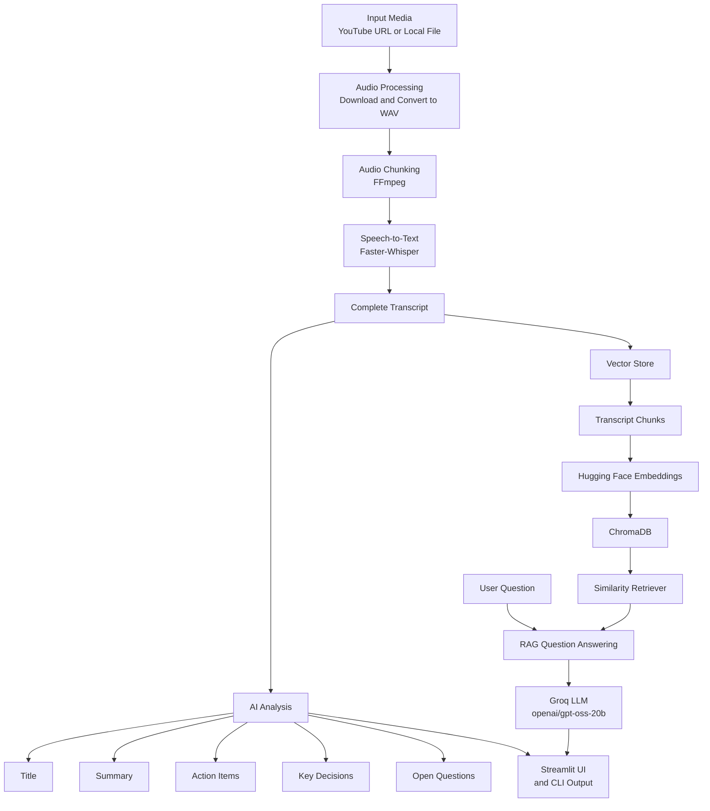

# 🎥 AI Video Assistant

An AI-powered video analysis application that transforms YouTube videos and local audio/video files into structured, searchable insights.

AI Video Assistant combines speech-to-text, Large Language Models (LLMs), semantic search, and Retrieval-Augmented Generation (RAG) to help users understand long-form video content without manually going through the entire recording.

The application processes the audio, generates a complete transcript, and uses the transcript to produce a professional summary, action items, key decisions, and open questions. The transcript is also indexed into a vector database, allowing users to ask questions about the video through a conversational RAG interface.

## 🏗️ System Architecture

The application follows a modular pipeline that combines media processing, speech-to-text, LLM-based analysis, vector storage, semantic retrieval, and Retrieval-Augmented Generation (RAG).
.png)

## ✨ Key Features

### 🎬 YouTube & Local Media Input

- Accepts YouTube video URLs as input.
- Supports local audio and video files.
- Automatically processes the provided media before transcription.

### 🔊 Audio Processing & Chunking

- Downloads YouTube audio using `yt-dlp`.
- Converts audio into WAV format using Pydub.
- Standardizes audio to 16 kHz mono.
- Splits long recordings into smaller audio chunks using FFmpeg for efficient processing.

### 🎙️ Multilingual Speech-to-Text

- Supports English and Hinglish transcription.
- Uses Faster-Whisper for English speech recognition.
- Uses Sarvam Speech-to-Text for Hinglish.
- Processes audio chunks and combines the resulting text into a complete transcript.

### 🧠 AI-Powered Video Analysis

Generates structured insights from the transcript using an LLM:

- Professional video/meeting title
- Concise summary
- Action items
- Key decisions
- Open questions

### 🔎 Semantic Search with Vector Database

- Splits the transcript into smaller chunks.
- Generates embeddings using `all-MiniLM-L6-v2`.
- Stores transcript embeddings in ChromaDB.
- Uses similarity search to retrieve relevant transcript content.

### 🧩 Retrieval-Augmented Generation (RAG)

- Retrieves the most relevant transcript chunks for a user's question.
- Uses top-4 similarity retrieval.
- Passes retrieved transcript context to the LLM.
- Grounds answers in the processed video's content.

### 💬 Conversational Video Q&A

- Allows users to ask questions about the processed video.
- Generates answers using retrieved transcript context.
- Provides a fallback response when the requested information cannot be found in the transcript.

### 🖥️ Interactive Streamlit Interface

- Provides a single interface for the complete workflow.
- Allows users to select the input source and language.
- Displays analysis results and the complete transcript.
- Provides an interactive RAG-based question-answering interface.

## 🔄 How the Application Works

The application follows a sequential processing pipeline that converts raw video or audio into structured insights and a searchable knowledge base.

### Main Modules

| Stage | Project Modules |
|---|---|
| Audio processing | `utils/audio_processor.py` |
| Transcription | `core/transcriber.py` |
| AI analysis | `core/summarizer.py`, `core/extractor.py` |
| Vector storage | `core/vector_store.py` |
| RAG question answering | `core/rag_engine.py` |
| Application entry points | `main.py`, `app.py` |

🔍 View Detailed Architecture

